# Журнал экспериментов: Vehicle Re-ID

Все проведённые эксперименты, их результаты и выводы. Реализация и инструкции по
запуску — в [README.md](README.md).

---

## 1. Как читать цифры: три разные методики оценки

Самая важная вещь в этом журнале — **метрики из разных методик несопоставимы между
собой**. Мы прошли через три, и каждая следующая опровергала выводы предыдущей.

| методика | что меряет | где | оговорка |
|---|---|---|---|
| **внутренняя валидация** | mAP по 154 отложенным id, полное ранжирование | `train.py`, каждые 10 эпох | завышена: не выбрасывает однокамерные дубликаты |
| **query/gallery-тест** | Rank-k, mAP на 150 не виденных id | `test_model.py` | то же завышение + структура галереи не как в тесте |
| **эталонный протокол** | mAP@10, Rank-1/5, F1, TNR, PR-AUC | `test_official.py` + `evaluate.py` организатора | junk-фильтрация, open-set, структура как в реальном тесте |

Ключевые правила эталонного протокола (из `evaluate.py`):

1. **junk-фильтрация** — из ранжирования выбрасываются объекты галереи с тем же
   `vehicle_id` **и** той же камерой, причём до усечения до 10 позиций;
2. **open-set** — запросы без валидного (кросс-камерного) позитива исключаются из
   mAP, но оцениваются в режиме отказа: ответ = FP, отказ = TN;
3. AP@10 нормируется на `min(n_pos, 10)`; ничьи разрешаются нашим порядком.

**Насколько велика разница.** Один и тот же ансамбль (тогда v2+veri+clip) на одних и
тех же данных, с junk-фильтрацией и без неё:

| | с junk-фильтрацией | без неё |
|---|---|---|
| mAP@10 | **0.696** | 0.822 |
| Rank-1 | **0.707** | 0.993 |

Причина: **141 из 150 наших top-1 — это junk** (тот же ТС, та же камера). Медиана
косинуса: junk-пара 0.845, валидный кросс-камерный позитив 0.311, негатив 0.000.
Наш «Rank-1 99%» означал «мы находим однокамерный дубликат», который не идёт в зачёт.

Числа в этом замере получены на первой версии репетиции, у которой структура галереи
была зеркальна реальному тесту (§7.1); величина расхождения между методиками от этого
не зависит, но сравнивать их с цифрами из §2 и §5 нельзя — те считаны на исправленной
репетиции.

---

## 2. Итог: что дала вся работа

| шаг (всё с настроенным re-ranking) | mAP@10 | прирост |
|---|---|---|
| v2 — Tier-1 | 0.8167 | — |
| + кросс-камерное обучение (v7) | 0.8529 | +3.6 |
| + ансамбль v7+clip+r101 | 0.8760 | +2.3 |
| **+ замена состава на v10ext+r101** | **0.8941** | **+1.8** |
| *справочно: ансамбль v7+clip+r101 без re-ranking* | *0.8384* | *вклад постобработки +3.8* |

Итоговая конфигурация — [`configs/config_ensemble.yaml`](configs/config_ensemble.yaml):
ансамбль **bestv10_512 + R101-IBN**, re-ranking `k1=10, k2=3, λ=0.5`, порог отказа `0.30`.
Метрики по эталонному протоколу: **mAP@10 0.8941, Rank-1 0.8425, Rank-5 0.9669, F1 0.598**.

`bestv10_512` — R101-IBN + 3 полосы + GeM, обученная **на входе 512px** за 180 эпох на
отдельной машине (см. §5.1): в одиночку она даёт 0.8744, то есть почти как весь наш
предыдущий ансамбль из трёх моделей.

## 3. Все модели

### 3.1. Сводная таблица

| модель | архитектура / что нового | вход | mAP@10 | Rank-1 | внутр. валидация |
|---|---|---|---|---|---|
| baseline | R50-IBN, Bag of Tricks, GAP, step-LR | 256 | — | — | 0.749 |
| parts | + PCB: 3 горизонтальные полосы | 256 | — | — | 0.767 |
| TransReID | ViT-B/16, чужой чекпоинт (29 эпох) | 256 | 0.397 | 0.440 | 0.778¹ |
| **v2** | `last_stride=1`, GeM, офиц. веса IBN-Net, cosine-LR, flip-TTA | 288 | 0.8167 | 0.7541 | 0.817 |
| v3 | + CosFace (margin-softmax) — **провал** | 288 | — | — | 0.712 |
| v4-veri | v2, инициализация из fast-reid VeRi-776 | 288 | 0.7950 | 0.7044 | 0.802 |
| v4-clip | v2, backbone = CLIP RN50 (`timm`) | 288 | 0.8391 | 0.7735 | 0.827 |
| v5-r101 | v2 на ResNet101-IBN-a | 256 | 0.8325 | 0.7459 | 0.823 |
| v6 | v2 + кросс-камерный трудный позитив в triplet | 288 | 0.8471 | 0.7790 | 0.805 |
| **v7** | v6 + camera-adversarial голова | 288 | **0.8529** | 0.7873 | 0.826 |
| v11 | DINOv2 ViT-S/14 + рецепт v7 | 224 | 0.6991 | 0.5967 | 0.701 |
| v12 | CLIP ViT-B/16 + рецепт v7 | 224 | 0.7238 | 0.6133 | 0.718 |
| v13 | ConvNeXt-Tiny + рецепт v7 — оптимизация сорвана | 288 | 0.7462 | 0.6354 | 0.760² |
| v14 | SE-ResNeXt50 + рецепт v7 | 288 | 0.7797 | 0.6796 | 0.810 |
| **bestv10_512** | R101-IBN + 3 полосы + GeM, обучена отдельно (§5.1) | **512** | **0.8744** | **0.8066** | 0.861 |

¹ на собственном сплите автора чекпоинта, не сопоставимо с остальной колонкой.
² пик на 9-й эпохе, затем падение до 0.675 и плато — см. §4.6.
Пустые клетки — модели, отброшенные до появления эталонного протокола.
Полный список, включая шесть внешних чекпоинтов, — на графике выше и в §5.1.

### 3.2. Внутренняя валидация обманывает

По внутренней метрике v6 — **худшая** из шести моделей (0.805), по эталонной —
**вторая лучшая** (0.8471). И наоборот: v4-clip лидирует внутри (0.827), но уступает
v7 по эталонной. Это прямое следствие junk-фильтрации: внутренняя валидация меряет
ровно те однокамерные пары, которые в зачёт не идут.

### 3.3. Кривые обучения

Общая черта всех удачных запусков: `train_acc` достигает 1.0 к 20–30 эпохе,
triplet-loss уходит в ~0.001, а val mAP продолжает расти до 120-й эпохи за счёт
отжига LR. Сокращать расписание нельзя — на 40-й эпохе мы бы потеряли 4–5 pt.

---

## 4. Обучение: что сработало и что нет

### 4.1. Tier-1 (v2): базовый набор трюков — сработало

| приём | почему |
|---|---|
| `last_stride=1` | трюк №2 из Bag of Tricks; карта признаков 18×18 вместо 9×9 — PCB-полосы становятся по 6 строк вместо 3/3/2 |
| GeM-pooling | стандарт fast-reid SBS вместо GAP; обучаемая степень p, счёт в fp32 |
| официальные веса IBN-Net | до этого IN-половина IBN-слоёв стартовала без претрейна |
| 288×288 вместо 256 | медианный bbox 669×485; 320px не влезает в 8 ГБ даже с checkpointing |
| cosine-LR | step-расписание резало LR в 10 раз на 40-й эпохе, когда mAP ещё рос |
| flip-TTA | +0.5–1 pt бесплатно по весам |

Внутренняя валидация: 0.767 → **0.817**.

### 4.2. Кросс-камерное обучение (v6/v7): сработало — главный выигрыш в обучении

Диагноз из эталонного протокола: в зачёт идут только кросс-камерные пары, а их
косинус (0.311) втрое ниже однокамерных (0.845). Обычный batch-hard triplet почти
всегда выбирает «трудным» позитивом однокамерный кадр, то есть учит лёгкому.

- **v6**: трудный позитив выбирается только среди кадров того же ТС с другой камеры
  (`train.cross_camera_triplet`, откат на обычный batch-hard, если таких нет в батче).
- **v7** = v6 + **camera-adversarial** голова: классификатор камеры через слой инверсии
  градиента (Ganin & Lempitsky, 2015) — backbone штрафуется за то, что по признаку можно
  угадать камеру. Голова живёт только в `train.py`, в чекпоинт модели и инференс не попадает.

Результат: **+3.6 pt mAP@10** к v2 (0.8167 → 0.8529) при почти одинаковой внутренней
валидации (0.817 → 0.826).

> **Скрытая зависимость.** С re-ranking по умолчанию (k1=20, k2=6, λ=0.3) v6 не давал
> ничего: 0.8191 против 0.8202 у v2. Разница появилась только с настроенными параметрами
> (k1=10, k2=3, λ=0.5). Камеро-инвариантные признаки сильнее выигрывают от re-ranking —
> два независимо задуманных улучшения оказались взаимозависимы.

### 4.3. Домен-претрейн (v4): не сработало как ожидалось

| источник инициализации | mAP@10 |
|---|---|
| ImageNet (IBN-Net) — v2 | 0.8167 |
| VeRi-776 (fast-reid `veri_sbs_R50-ibn`) — v4-veri | 0.7950 |
| CLIP RN50 (OpenAI, 400M пар) — v4-clip | 0.8391 |

Ожидался скачок от доменного претрейна на 50k фото дорожных камер, а VeRi-инициализация
оказалась **хуже** ImageNet. Вероятная причина: рецепт (`lr 3.5e-4` × 120 эпох) подобран
под ImageNet-старт и за первые 20 эпох «смывает» сильный претрейн. CLIP выиграл 2 pt —
единственный полезный из двух.

### 4.4. Архитектуры: перепробовано восемь семейств, выиграло разрешение

Один и тот же рецепт (v7: кросс-камерный triplet + camera-adversarial + аугментации),
восемь backbone'ов:

| семейство | модели | mAP@10 |
|---|---|---|
| ResNet-IBN / CLIP RN50 | v2, v5-r101, v4-clip, v6, v7 | 0.817–0.853 |
| ResNet + attention | SE-ResNeXt50 | 0.780 |
| ConvNeXt | ConvNeXt-Tiny | 0.746 (оптимизация сорвана) |
| ViT | DINOv2 ViT-S, CLIP ViT-B, TransReID | 0.397–0.724 |

Картина устойчивая: **наш рецепт настроен под ResNet, и всё, что от ResNet отличается,
под ним проигрывает.** Это свойство связки «архитектура + рецепт», а не архитектур:
ConvNeXt требует AdamW с `wd≈0.05`, ViT — layer-wise LR decay и другой warmup, а у нас
Adam с `wd=0.0005`. Дать им шанс — отдельный исследовательский проект.

**Что на самом деле оказалось рычагом — разрешение.** `bestv10_512` отличается от нашего
`v5-r101` только входом (512 против 256) и числом эпох (180 против 120) — и выигрывает
**4.2 pt** (0.8744 против 0.8325), больше, чем любая смена архитектуры. Мы весь проект
упирались в 8 ГБ VRAM и сидели на 288/256px. Подробности в §5.1.

**Вывод:** при 1387 обучающих id порядок важности рычагов такой: что оптимизируем
(кросс-камерность, +3.6 pt) → разрешение входа (+4.2 pt на R101) → ансамблирование
(+2 pt) → постобработка (+3.8 pt) → и только потом ёмкость и семейство сети.

### 4.5. Margin-softmax (v3): провал, задокументирован

CosFace/ArcFace/Circle реализованы как сменная голова (`src/model.py:MarginClassifier`),
запущен CosFace (s=30, m=0.3):

- val mAP: пик 0.712 на 19-й эпохе, дальше **монотонное падение** до 0.675 (v2 на тех же
  эпохах: 0.770 → 0.808);
- медиана косинуса своих пар **упала** 0.396 → 0.325, разделимость не улучшилась;
- enrollment-точность 0.729 против 0.760 у v2.

Гипотеза «margin сделает сходство пороговым» на 6 фото на класс не подтвердилась: margin
сжимает *обучающие* классы за счёт запоминания, и на новые id это не переносится. Опция
осталась в коде, по умолчанию выключена.

---

### 4.6. Трансформеры и другие семейства: три попытки, все отрицательные

Проверено после того, как стало ясно, что все члены ансамбля — свёрточные, а ошибки
однотипных архитектур коррелируют (четвёртый ResNet прироста не давал).

**Поддержка в коде.** `src/model.py:TimmBackbone` доработан: ViT отдают токены
`(B, N+prefix, C)`, а GeM и PCB-полосы ждут карту `(B, C, H, W)` — добавлен разбор
(отбрасывание служебных токенов по `num_prefix_tokens`, раскладка патчей в сетку
`patch_embed.grid_size`) и `model.img_size` для интерполяции позиционных эмбеддингов.
Свёрточные семейства подключились без правок: ConvNeXt, SE-ResNeXt и ResNeSt
поддерживают `output_stride=16` и дают ровно нашу карту 18x18 при 288px.

**Стоимость обучения** оказалась много ниже, чем подсказывал опыт с TransReID
(~30 мин/эпоху — там был своп из-за переполнения 8 ГБ):

| backbone | VRAM | эпоха (GPU) | 120 эпох |
|---|---|---|---|
| DINOv2 ViT-S/14 | 3.5 ГБ | 16 с | 1.3 ч |
| CLIP ViT-B/16 | 2.3 ГБ | 37 с | 1.8 ч |
| ConvNeXt-Tiny | 2.4 ГБ | 64 с | 2.1 ч |
| SE-ResNeXt50 | 3.7 ГБ | 76 с | 2.5 ч |

**Результат — ни одна комбинация не превзошла базовый ансамбль** (тогда 0.8760):

| состав | mAP@10 |
|---|---|
| v7+clip+r101 (база на тот момент) | **0.8760** |
| v7+clip+r101+senext | 0.8724 |
| v7+clip+r101+clipvit | 0.8623 |
| v7+clip+r101+dino | 0.8618 |
| v7+clip+r101+convnext | 0.8537 |
| v7+clip+r101+senext+convnext | 0.8517 |
| v7+clip+r101+dino+clipvit | 0.8556 |

Гипотеза «разнообразие архитектур декоррелирует ошибки» **не подтвердилась**:
разнообразие не помогает, если новый член слабее остальных на 8–15 pt. Отдельно
отмечу два наблюдения:

- **CLIP ViT-B к 120-й эпохе ещё рос** (0.709 → 0.718). Продление до 200 эпох с
  warm-restart запущено и прервано; темп +0.9 pt за 20 эпох против отставания 13 pt —
  дообучением этот разрыв не закрыть.
- **ConvNeXt не обучился**: пик 0.7598 на 9-й эпохе, затем падение до 0.675 и плато на
  110 эпох — тот же профиль, что у провального v3. Честный вывод по ConvNeXt —
  «не проверен», а не «хуже».

Код поддержки ViT и timm-семейств остался в проекте и переиспользуем: любой backbone
подключается одной строкой конфига (`backbone: "timm:<name>"`).

### 4.7. Сегментация фона (v18): не сработало, фон несёт полезный сигнал

Идея: фон в кропе камероспецифичен (асфальт, разметка, соседние машины), а в зачёт
идут только кросс-камерные пары — значит, фон стоит убрать. Схема двухсетевая:
Mask R-CNN ResNet50-FPN v2 (COCO) сегментирует ТС, ReID-сеть считает эмбеддинг уже
по вырезанному изображению.

**Маски посчитаны один раз** (`precompute_masks.py`) для всех 11416 кадров датасета:
из экземпляров классов car/bus/truck берётся тот, чья рамка сильнее пересекается с
разметкой. Качество масок высокое — IoU с данной рамкой 0.955 (медиана), ТС не найдено
всего в 7 кадрах из 11416. Хранение RLE, 12.4 МБ на весь датасет, 35 мин GPU разово.
Под маской оказывается 53% площади кропа с полем, то есть подавляется 47%.

**Результат — отрицательный.** Каждая модель лучше всего работает в тех условиях, в
которых обучалась, но вырезание фона проигрывает при любом сравнении:

| обучение → | без масок (v7) | вырезание фона (v18) |
|---|---|---|
| инференс: фон как есть | **0.8031** | 0.6722 |
| инференс: фон затемнён | 0.7528 | 0.7062 |
| инференс: фон вырезан | 0.6561 | **0.7340** |

Согласование обучения и инференса даёт много — оно отыграло 7.8 pt у рассогласованного
случая (0.6561 -> 0.7340). Но лучший результат масочного конвейера всё равно на
**6.9 pt ниже** обычного. `test_model.py --split unseen` подтверждает направление:
mAP 0.8183 против 0.7802, Rank-1 0.9935 против 0.9740. Разрыв там меньше (3.8 pt),
потому что без junk-фильтрации метрика упирается в потолок и хуже различает модели
(§7.1) — доверять нужно эталонной цифре. Вывод: фон несёт полезный для сопоставления сигнал, а не
только камероспецифичный шум. Правдоподобное объяснение — вместе с фоном маска срезает
тень, отражения и границу кузова, а ошибки сегментации на инференсе бьют по запросу
напрямую.

**Оговорка о чистоте сравнения.** v18 обучался батчем 32, а v7 — батчем 64 (см. §8:
на карте 8 ГБ батч 64 перестал помещаться). Уменьшение батча ослабляет батч-хард
triplet, и по опыту литературы стоит 1–3 pt. То есть на долю самих масок приходится
примерно 4–6 pt из 6.9 — направление вывода сомнений не вызывает, точная величина
неизвестна. Базовая линия на батче 32 не обучалась ради экономии времени.

**Цена, которой всё равно пришлось бы платить:** сегментатор добавляет 147 мс на запрос
(против 58 мс всего поиска сейчас) и 176 МБ весов в сервис.

Код поддержки масок остался в проекте и переиспользуем: `data.mask_mode` и
`data.mask_mode_eval` принимают `none` / `hard` / `soft` / `random`, маски читаются
`reid.dataset.MaskStore`. Не проверен вариант `soft` в обучении (конфиг
`configs/config_v16_masksoft.yaml` готов) — по таблице выше он теряет вдвое меньше и
остаётся единственным незакрытым направлением этой ветки.

## 5. Ансамбли

| состав | mAP@10 | Rank-1 | лучший F1 |
|---|---|---|---|
| лучшая одиночная (v7) | 0.8529 | 0.7873 | 0.553 |
| v2+veri+clip | 0.8660 | 0.8094 | 0.560 |
| v7+veri+clip | 0.8699 | 0.8122 | 0.565 |
| **v7+clip+r101** | **0.8760** | **0.8232** | **0.574** |
| v7+veri+clip+r101 | 0.8678 | 0.8011 | 0.574 |
| все шесть моделей | 0.8681 | 0.8094 | 0.575 |
| + TransReID к четвёрке | 0.8415¹ | — | — |

¹ замер на предыдущей методике; TransReID **ухудшает** ансамбль во всех проверках.

Эмбеддинг ансамбля — конкатенация L2-нормированных эмбеддингов членов (косинус
конкатенации = среднее косинусов членов). Ансамбль даёт **+2 pt** к лучшей одиночной
модели, но больше трёх членов не помогает, а шесть-семь уже хуже двух-трёх: слабый член
тянет вниз. Итоговый состав — **два** члена (§5.1), 2 × 2816 = 5632-d.

**Про двойной ресайз.** `EnsembleWrapper` подаёт всем членам один батч в размере
**первого** члена, остальные ресайзят его под себя. Для состава v7+clip+r101 (288 у
первого, 256 у R101) это стоило ~0.5 pt: 0.8715 в сквозном прогоне против 0.8760 при
раздельном извлечении. В итоговом составе первым стоит член с самым большим входом
(512), поэтому остальные только уменьшают картинку, и потери нет: сквозной прогон дал
0.8941 против расчётных 0.8944. **Порядок членов в конфиге важен — первым ставится
модель с наибольшим входом.**

---

## 5.1. Внешние чекпоинты: разрешение оказалось недобранным рычагом

Шесть моделей, обученных на другой машине, протестированы нашим стандартным
конвейером. Конфигов к ним не было: архитектуру опознали по `state_dict`
(число блоков `layer3`, наличие `part_reduce`/`gap.p`), вход и `last_stride`
подобрали сканом по сетке — результаты в [`configs/external/`](configs/external/).

| чекпоинт | архитектура | вход | эпох | mAP@10 | Rank-1 | F1 |
|---|---|---|---|---|---|---|
| **bestv10_512** | R101-IBN + 3 полосы + GeM | 512 | 180 | **0.8744** | 0.8066 | **0.5877** |
| наш v7 (для сравнения) | R50-IBN + 3 полосы + GeM | 288 | 120 | 0.8529 | 0.7873 | 0.5531 |
| bestv2_512+ | R50-IBN + 3 полосы + GeM | 512 | 110 | 0.8020 | 0.7320 | 0.5280 |
| bestresnet700 | R50-IBN без полос | 700 | 70 | 0.8005 | 0.7293 | 0.5171 |
| bestpart_700 | R50-IBN + 3 полосы | 700 | 180 | 0.7955 | 0.7265 | 0.5280 |
| parts512best | R50-IBN + 3 полосы | 384 | 20 | 0.7513 | 0.6492 | 0.4535 |
| best_resnet101_reid+ | torchvision R101 без IBN | 256x128 | ? | 0.6743 | 0.5359 | 0.3878 |

Вывод: `bestv10_512` отличается от нашего `r101` (0.8325) только **входом 512 вместо 256**
и числом эпох (180 против 120) - и выигрывает 4.2 pt. Мы всё время упирались в 8 ГБ
VRAM и ушли на 288/256px; разрешение оказалось сильным рычагом, который мы недобрали.
Косвенное подтверждение: у этой модели и лучший F1, и самый высокий PR-AUC из виденных -
на 512px кросс-камерные пары различаются лучше.

### Ансамбли с внешними моделями

| состав | mAP@10 | Rank-1 | F1 |
|---|---|---|---|
| v7+clip+r101 (прежний) | 0.8760 | 0.8232 | 0.5743 |
| **v10ext+r101** | **0.8944** | 0.8425 | 0.5975 |
| v10ext+v7 | 0.8932 | **0.8453** | 0.5927 |
| v10ext+clip+r101 | 0.8924 | 0.8425 | **0.6005** |
| v10ext+v7+clip | 0.8874 | 0.8398 | 0.5966 |
| v10ext+v7+clip+r101 | 0.8822 | 0.8260 | 0.5925 |
| v10ext + все пять внешних + наши три | 0.8681 | 0.8149 | 0.5811 |

Выбран `v10ext+r101`: максимум mAP@10, F1 в пределах шума от лучшего, и всего два члена
вместо трёх. Сквозной прогон (`infer.py` → `evaluate.py`) подтвердил расчёт: 0.8941.
Остальные пять внешних чекпоинтов слабее наших и ансамбль ухудшают.

## 6. Постобработка

| приём | результат |
|---|---|
| re-ranking по умолчанию (k1=20, k2=6, λ=0.3) | 0.822 → 0.854 |
| **re-ranking настроенный (k1=10, k2=3, λ=0.5)** | **0.854 → 0.866** |
| alpha-QE (k=2..8, α=1..3) | не помогает ни с re-ranking, ни без — отброшено |
| дедупликация похожих кандидатов (τ=0.8..0.98) | **вредит**: 0.696 → 0.45–0.53 |
| MMR-диверсификация (λ=0.2..0.6) | **вредит**: 0.696 → 0.29–0.53 |

Параметры re-ranking проверены на двух половинах запросов (0.8656 / 0.8664 — устойчивы)
и **сильно зависят от структуры галереи**: на первой, неверно построенной репетиции
оптимум был k1=6, k2=3, λ=0.1, и на правильной структуре он не воспроизводится.

Идея дедупликации была такой: junk-позиции в зачёт не идут, значит их место в топ-10
могли бы занять полезные кандидаты. Не работает — похожесть не различает junk и валидные
позитивы того же ТС, а без `camera_id` на тесте junk отфильтровать нечем.

---

## 7. Структура теста и режим отказа

### 7.1. Структура реального теста обратна нашему сплиту

Проверено по эмбеддингам (компоненты связности галереи при пороге 0.7):

| | реальный тест | `query_split`/`gallery_split` |
|---|---|---|
| галерея | 750 фото, **749 компонент** → 1 кадр на ТС | 761 фото, 446 компонент → ~5 кадров на ТС |
| query | 1110 фото, у 64% есть дубликат среди query | 150 фото, дубликатов нет |
| отрыв top-1 от top-2 | 0.432 | 0.071 |

Первая версия репетиции была построена зеркально реальному тесту, и все подобранные на
ней параметры к делу не относились. `make_rehearsal.py --structure real` собирает
правильную: один случайный кадр каждого ТС в галерею, остальные в query.

Следствие: у запроса в галерее **не более одного позитива**, и если этот единственный
кадр снят той же камерой — он junk, запрос выпадает из mAP, а любой наш ответ на него
считается FP. На репетиции таких запросов **194 из 556** (35% тех, чьё ТС есть в галерее).

### 7.2. Порог отказа: сценарии тянут в разные стороны

Open-set бывает двух видов, и они требуют противоположных порогов:

- **ТС нет в галерее** — косинус низкий, высокий порог отсекает хорошо;
- **junk-only: ТС есть, но та же камера** — косинус высокий (0.845), порогом не
  отсекается в принципе; чем выше порог, тем большую долю принятых составляют именно они.

Доля запросов с валидным ответом по величине top-1 косинуса **немонотонна**:

| косинус | 0.2–0.3 | 0.3–0.5 | 0.5–0.6 | 0.6–0.7 | 0.8–1.0 |
|---|---|---|---|---|---|
| доля валидных | 50% | **85%** | 71% | 4.5% | **0%** |

Порог калибровался пять раз, каждый раз на более верной модели данных или новом составе
ансамбля: 0.5 → 0.425 → 0.375 → 0.50 → 0.25 → **0.30** (итоговый состав v10ext+r101).

### Два критерия качества — и они сходятся

У организатора однокамерное совпадение — **ошибка** (junk-правило), а для реальной
эксплуатации «нашли ту же машину, пусть и с той же камеры» — **правильный ответ**.
Это разные метрики, поэтому порог проверен под оба (итоговый ансамбль, репетиция с
реальной структурой; 52% запросов без валидной пары по критерию организатора и 27%
без пары в базе по критерию эксплуатации):

| порог | F1 (организатор) | F1 (эксплуатация) | precision (эксплуатация) | recall | отвечаем |
|---|---|---|---|---|---|
| 0.25 | 0.575 | 0.808 | 0.692 | 0.969 | 89% |
| **0.30** | **0.593** | **0.837** | 0.782 | 0.901 | 76% |
| 0.35 | 0.576 | 0.837 | 0.840 | 0.834 | 67% |
| 0.45 | 0.440 | 0.758 | 0.908 | 0.651 | 50% |
| 0.60 | 0.118 | 0.558 | 1.000 | 0.387 | 28% |

Оптимум F1 совпал у обоих критериев — **0.30**, плато 0.30–0.35. Это и стоит в
`configs/config_ensemble.yaml`.

### Рабочие точки для эксплуатации

Выбор рабочей точки — решение заказчика, а не модели:

| режим | порог | precision | recall | доля запросов с ответом |
|---|---|---|---|---|
| подсказка оператору (он проверит) | 0.30 | 0.782 | 0.901 | 76% |
| баланс | 0.35 | 0.840 | 0.834 | 67% |
| точность ≥ 90% | 0.45 | 0.908 | 0.651 | 50% |
| точность ≥ 95% | 0.55 | 0.966 | 0.463 | 35% |
| автоматическое решение без человека | 0.60 | **1.000** | 0.387 | 28% |

### Перенос порога на реальный тест: оговорка

Распределения top-1 косинуса у репетиции и реального теста заметно разные:

| | p10 | медиана | p90 |
|---|---|---|---|
| репетиция | 0.244 | 0.452 | 0.921 |
| **реальный тест** | 0.593 | **0.898** | 0.974 |

Реальный тест «легче»: при пороге 0.30 мы ответим на **1106 из 1110** запросов, то есть
порог там почти ничего не отсекает (в тесте больше почти-дубликатов, и галерея 750
объектов против 112 у нас). Для сабмишена это приемлемо — порог выбран на единственных
размеченных данных, что и требуется обосновать. Для эксплуатации порог нужно
перекалибровать на боевом потоке: иначе сервис почти никогда не откажет и на запросах
без пары в базе начнёт выдавать ложные совпадения.

### 7.3. Нерешённое: потолок режима отказа

PR-AUC держится на **0.35–0.41** и почти не двигается ни от смены модели, ни от состава
ансамбля (лучший результат — 0.4145 у `bestv10_512`, единственной модели на 512px):
уверенность не отличает «то же ТС с той же камеры» (FP по правилам организатора) от
«то же ТС с другой камеры» (TP), а на инференсе `camera_id` нет. F1 по критерию
организатора упирается в ~0.60.

Проверенный, но **не включённый** вариант — полосовой фильтр (отвечать только при
0.25 ≤ cos ≤ 0.75, слишком похожие отклонять как вероятный junk): на репетиции даёт F1
0.657 против 0.558 и PR-AUC 0.626 против 0.406. Риск симметрично велик: если в реальном
тесте пары кросс-камерные (а не однокамерные, как показывает медиана 0.857), полоса
отбросит именно правильные ответы. Нужен ответ организаторов, гарантирована ли в тесте
съёмка разными камерами.

---

## 8. Инфраструктурные находки и исправления

| что | почему это было важно |
|---|---|
| `submission.csv` без заголовка | `evaluate.py` читает его `csv.reader`'ом — строка заголовка парсилась как данные |
| `confidence` в `candidates.csv` = косинус, а не re-ranked score | порог калибровался на косинусе; на шкале re-ranking принималось 1105/1110 с «уверенностью» 0.97 |
| `grad_checkpoint` для layer3/4 | −1 ГБ VRAM за +30% времени; без него 288px не влезает в 8 ГБ |
| `pin_memory: false`, 2 воркера | при 4 воркерах обучение падало с `pickle data was truncated` — это нехватка RAM, не баг кода |
| `MarginClassifier` считает косинус в fp32 с выключенным autocast | в fp16 при s=30 теряется точность |
| GeM в fp32 | `x^p` при p≈3 в fp16 переполняется |
| замеры латентности прогревают GPU | на ноутбучной 3070 без прогрева SM держит 420 МГц из 2100 — цифры втрое хуже |
| батч 64 перестал помещаться в 8 ГБ | обучение замедлилось с 57 с до 5 мин на эпоху **при 100% загрузки GPU и штатных частотах** — Windows не выдаёт ошибку нехватки видеопамяти, а вытесняет её в системную через PCIe. Замер по батчам: 8/16/32 дают ровные 12-13 мс на семпл, батч 64 — 360 мс. Причина — фоновые программы заняли 1192 МБ VRAM, а запас был всего 154 МБ |

---

## 9. Производительность

Разбор по этапам конвейера (`infer.py --benchmark`), RTX 3070 Laptop 8 ГБ, AMP,
flip-TTA включён (то есть два forward'а на кадр):

| этап | итоговый ансамбль (v10ext+r101, вход 512) | что это |
|---|---|---|
| подготовка кадра (CPU, 1 поток) | 16.8 мс | декод JPEG + кроп по bbox + ресайз + нормализация |
| **эмбеддинг, batch=1** | **58.3 мс** (17.1 FPS) | **метрика организатора** — время формирования признака на одно ТС |
| эмбеддинг, batch=12 | 19.9 мс/кадр (50 FPS) | пакетная пропускная способность |
| поиск по галерее (750 фото) | 0.20 мс | косинус 5632-d против всей галереи + сортировка |
| re-ranking всех 1110 запросов | 0.5 с всего | разовая операция на весь набор, не на кадр |
| **итого на один запрос** | **75.3 мс** (13.3 запросов/с) | подготовка + эмбеддинг + поиск |

Два члена вместо трёх компенсировали рост разрешения: 58 мс против 69 мс у прежнего
ансамбля, при +1.8 pt mAP@10. Вес: 184 + 184 = 368 МБ при лимите 2 ГБ; в поставке сервиса чекпоинты хранятся в fp16, то есть 92 + 92 = 184 МБ — на качество не влияет, при загрузке веса приводятся к fp32.

Поиск и re-ranking в стоимости почти не участвуют: галерея из 750 объектов — это
матричное умножение на треть миллисекунды, а re-ranking для всех 1110 запросов
занимает полсекунды суммарно и выполняется один раз, не на каждый кадр.
Доминирует прогон сети, вторым идёт подготовка кадра на CPU (в сервисе
распараллеливается по воркерам).

Задержка `batch=1` по моделям (только эмбеддинг):

| модель | вход | batch=1 | вес |
|---|---|---|---|
| v2 / v7 (R50-IBN) | 288 | 14.7 мс | 111 МБ |
| v4-clip (CLIP RN50) | 288 | 19.3 мс | 111 МБ |
| v5-r101 (R101-IBN) | 256 | 28.3 мс | 184 МБ |
| **ансамбль v7+clip+r101** | 288 | **68.7 мс** | 333 МБ |

> **Оговорка про замеры.** На ноутбучной 3070 результат сильно зависит от
> энергорежима и прогрева: без прогрева SM держит 420 МГц из 2100, и те же модели
> показывают втрое худшие цифры (v2 — 52 мс вместо 14.7). В таблице значения на
> прогретом GPU; они воспроизвелись в двух независимых сессиях. Финальные замеры
> организатор проводит на своём оборудовании, поэтому сравнивать осмысленно
> отношения между моделями, а не абсолютные числа.

## 9.1. Поиск по базе: что тормозит и что с этим делать

Замеры на базе 10 000 объектов (`src/search.py` реализует выводы этого раздела).

### Сам поиск дёшев, БД не нужна

| размер базы | память (5632-d) | numpy fp32 | numpy **fp16** | torch GPU |
|---|---|---|---|---|
| 750 | 0.02 ГБ | 0.34 мс | **9.99 мс** | 0.09 мс |
| 10 000 | 0.21 ГБ | 5.8 мс | **142 мс** | 0.61 мс |
| 100 000 | 2.1 ГБ | 56 мс | **1362 мс** | 5.4 мс |
| 1 000 000 | 21 ГБ | не хватило RAM | | |

- **Векторная БД / ANN-индекс (faiss, hnswlib, pgvector) на 10 тысячах только замедлит**:
  brute-force матмул не имеет накладных расходов на обход индекса. ANN окупается
  от ~100 тысяч векторов; БД оправдана как хранилище (добавление/удаление ТС,
  персистентность), но не как ускоритель.
- **float16 на CPU - ловушка**: в numpy нет BLAS для fp16, он распаковывает поэлементно,
  и поиск замедляется в 25 раз. Хранить в fp16 можно, считать - только в fp32.
- Память становится стеной около 1 млн векторов при 5632-d - там уже нужны квантизация
  и внешнее хранилище.

### Настоящий тормоз - re-ranking, а не поиск

k-reciprocal строит матрицу (N+1)x(N+1) по **всей базе** на каждый запрос:

| база | матрица | память | время одного запроса |
|---|---|---|---|
| 750 | 751x751 | 2 МБ | 0.12 с |
| 2 000 | 2001x2001 | 15 МБ | 0.34 с |
| 5 000 | 5001x5001 | 95 МБ | 1.48 с |

Это в десятки тысяч раз дороже самого поиска. В `infer.py` незаметно, потому что там
re-ranking вызывается один раз на весь пакет из 1110 запросов (0.5 с суммарно).

### Проверено и отброшено: re-ranking по шортлисту

Идея - переранжировать только top-k кандидатов вместо всей базы. **Хуже даже простого
косинуса**, при этом в тысячи раз медленнее:

| способ | mAP@10 | Rank-1 | время/запрос |
|---|---|---|---|
| только косинус | 0.8597 | 0.7983 | 0.0003 мс |
| **re-ranking, весь пакет запросов** | **0.8941** | **0.8425** | 0.26 мс |
| шортлист top-100 | 0.8400 | 0.7624 | 16.8 мс |
| шортлист top-50 | 0.8253 | 0.7403 | 8.6 мс |

Причина видна из скана по размеру пакета запросов:

| пакет запросов | 1 | 10 | 50 | 250 | 761 |
|---|---|---|---|---|---|
| mAP@10 | 0.8597 | 0.8373 | 0.8226 | 0.8645 | **0.8941** |

**Весь выигрыш re-ranking берётся из связей между запросами, а не по галерее** - алгоритм
строит граф по объединению query+gallery, а в реальном тесте у 64% запросов есть
почти-дубликаты среди других запросов (§7.1). На маленьком пакете этих связей нет, и
re-ranking не просто не помогает, а портит порядок.

**Вывод: в онлайне, когда запросы приходят по одному, re-ranking неприменим в принципе** -
не из-за скорости, а потому что его эффект существует только в пакетном режиме.

### Сокращение размерности почти бесплатно

PCA обучается на признаках базы (whitening проверен и **ухудшает** на 6-11 pt - не применять):

| вариант | mAP@10 с re-ranking | mAP@10 без re-ranking | память на 10k | поиск |
|---|---|---|---|---|
| 5632-d (как есть) | **0.8941** | 0.8597 | 215 МБ | 5.9 мс |
| PCA 1024-d | 0.8815 | 0.8549 | 39 МБ | 1.0 мс |
| PCA 512-d | 0.8772 | 0.8578 | 20 МБ | 0.58 мс |
| **PCA 256-d** | 0.8817 | **0.8570** | **10 МБ** | **0.43 мс** |
| PCA 128-d | 0.8794 | 0.8560 | 5 МБ | 0.2 мс |

В онлайн-режиме (без re-ranking) PCA до 256-d стоит **0.3 pt** - фактически бесплатно при
экономии памяти и времени в 20 раз. В пакетном режиме дороже (1.3 pt), поэтому для
сабмишена размерность не сокращаем.

### Итоговые режимы работы

| режим | как искать | mAP@10 | задержка при базе 10k |
|---|---|---|---|
| **онлайн, запрос за запросом** | косинус на PCA 256-d | 0.8570 | **0.43 мс** |
| онлайн, полная размерность | косинус на 5632-d | 0.8597 | 5.9 мс |
| **пакетный (сабмишен)** | косинус + re-ranking по всему пакету | **0.8941** | 0.26 мс/запрос |

Реализация - `src/search.py:VehicleIndex`: хранение в float32 C-порядка, `argpartition`
вместо полной сортировки, опциональная PCA-проекция (фиксируется при построении),
добавление/удаление объектов, сохранение в `.npz`. Вызов с `rerank=` на пакете меньше
10 запросов намеренно падает с объяснением - чтобы эффект пакетного режима не приняли
за онлайновый.

## 10. Что делать дальше

Приоритеты пересмотрены после §5.1: разрешение входа оказалось сильнее всех
архитектурных экспериментов.

1. **Переобучить наши модели на 512px** — измеренный рычаг: `bestv10_512` выигрывает
   4.2 pt у нашего же R101 только за счёт входа 512 вместо 256. На 8 ГБ это не влезает,
   нужна карта на 16 ГБ и больше (или `grad_checkpoint` + батч 32). Самое ценное из
   оставшегося.
2. **Кросс-камерный рецепт на 512px** — пункты 1 и 2 объединяются в один прогон:
   у `bestv10_512` кросс-камерного обучения нет, а оно дало нам +3.6 pt на 288px.
   Конфиги v8/v9/v10 готовы, инструкция — в [RETRAIN.md](RETRAIN.md).
3. **Обучить финальные модели на train+val** (все 1541 id вместо 1387). +11%
   идентичностей; проверить будет уже нечем, поэтому только после всех решений.
4. **Отдельные transforms на члена ансамбля** — сейчас потерь нет (первый член имеет
   наибольший вход), но при смене состава ловушка вернётся; стоит убрать совсем.
5. **Ответ организаторов про камеры в тесте** — разблокирует решение по §7.3, где лежат
   потенциальные +10 pt F1.

Исчерпано и переспрашивать не стоит: смена семейства backbone (§4.4, §4.6),
margin-softmax (§4.5), доменный претрейн VeRi (§4.3), дедупликация и MMR, alpha-QE (§6),
TransReID и ViT в ансамбле (§4.6), вырезание фона по маске сегментации (§4.7).
